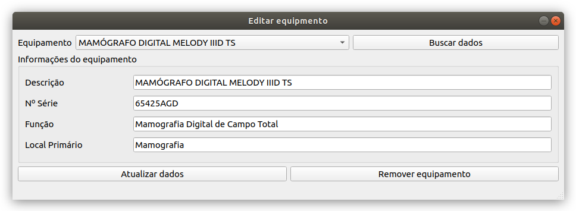

# LOGAH
The LOGAH (Localizador e Gerenciador de Ativos Hospitalares) aims into keeping a record of all
registered equipment in a hospital. It uses the XBee technology (ZigBee protocol) to provide information about
localization of a given asset inside an ambient.
## Usage
First, configure all the devices using the XCTU software (link available at the section "Installs" bellow). Power then accordingly to your needs.
To use this software, install the libraries described at the section "Installs" bellow, download or clone the repository. Change your directory to LOGAH/app/xbee manager. Connect the coordinator (local device) to your computer and execute the program.
To execute the program, using Python 3, execute the main_gui.py program:

`$ python3 main_gui.py`

It's recommended you use a virtual environment such as `virtualenv` to install the libraries
and execute the program.

If your local XBee is not connected to the computer, a message indicating that the device is not connected will be shown on your console/terminal.
## App overview

Main screen

List all equipment screen

Add equipment screen

Edit equipment screen

## XBee documentation
### RF Kits Common
    Doc.: http://docs.digi.com/display/RFKitsCommon/Introduction+to+the+XBee+modules
### Libraries used
 1. [Arduino SoftwareSerial Library](https://www.arduino.cc/en/Reference/SoftwareSerial)
 1. [Python XBee Python Library](http://xbplib.readthedocs.io/en/latest/)
 1. [Java XBee Java Libray](https://www.digi.com/resources/documentation/digidocs/90001438/#concepts/c_90001438.htm%3FTocPath%3D_____1)
 1. [PyQt5 5.10.1](http://pyqt.sourceforge.net/Docs/PyQt5/)
 1. [psycopg2](https://wiki.postgresql.org/wiki/Psycopg2)

## Installs
### Installing Digi's Python Xbee library

  1. Install Digi library

  `pip3 install digi-XBee`

### Installing PyQt5

  1. Install QtDesigner

  `sudo apt-get install qt4-designer`

  2. Install PyQt5

   `pip3 install pyqt5`

### Installing PostgreSQL database adapter
  1. Installing binary

  `pip3 install psycopg2-binary`

## Configurando o banco de dados

Faça o download e instale o PostgreSQL e o pgAdmin

1. `$ sudo apt-get install postgresql`
1. `$ sudo apt-get install pgadmin3`

Configure o BD

1. `$ sudo su`
1. `$ su postgres`
1. `# psql`
1. `# \password`
1. `# banco`

    Obs.: Este password acima foi o configurado no programa. Altere-o de acordo com as suas necessidades (no seu BD e no programa).

1. Para sair: `# exit`

> Ao finalizar as configurações do BD, siga as instruções dentro do arquivo `db_sql.sql`

## Permissões de acesso as portas USB no Linux

Caso você esteja utilizando Linux, será necessário adicionar permissão ao seu usuário para utilização de portas USB do seu computador.
Para que o dispositivo local (coordenador) seja reconhecido pelo programa, execute no seu terminal as seguintes linhas:

  `$ sudo usermod -a -G dialout <nomedousuario>`

Ao executar esta linha, você estará incluindo seu usuário ao grupo autorizado a abrir portas.

    Obs.: Para que as alterações tomem efeito, é necessário que você 'deslogue' e 'logue' novamente no seu sistema operacional.
